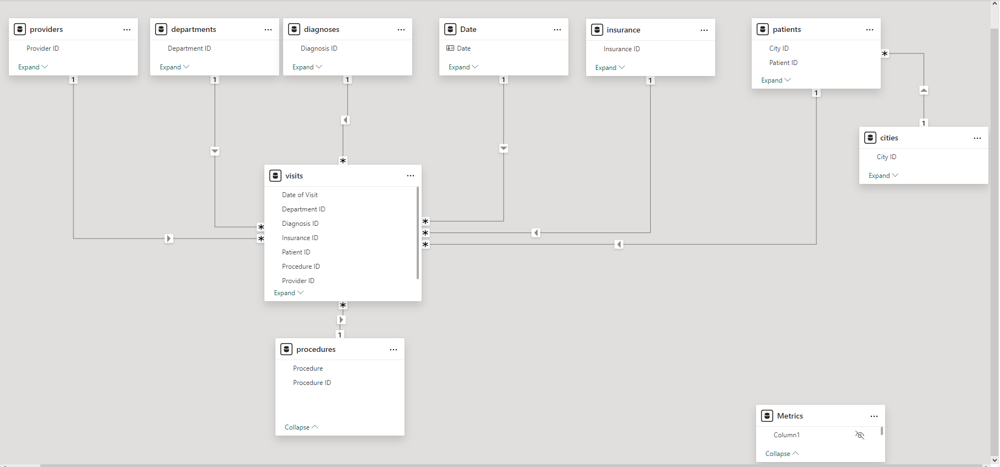
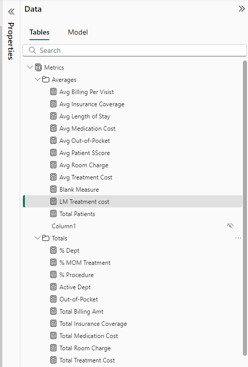

# Healthcare Power BI Dashbord

## Purpose

This dashboard provides insights into healthcare billing, focusing on billing amounts, costs, and patient-related financial metrics. It helps stakeholders understand key metrics such as:
- Total Billing Amount and Average Billing Per Visit
- Breakdown of billing by procedure, diagnosis, and department
- Cost-specific categories (e.g., Medication Cost, Treatment Cost, Room Charges)
- Financial contributions of insurance and out-of-pocket payments
 

##Key Features
- KPIs at the Top: The key performance indicators (KPIs) such as total billing amount, average billing per visit, and specific costs.
- Filters Panel: Dynamic filters (e.g., Patient Name, Provider Name, Insurance Provider, Diagnosis, and Date) allow users to customize their views for detailed insights.
- Breakdowns:
  By Procedure, a bar chart showing total billing amounts by medical procedure. By Department, a horizontal bar chart highlighting contributions of various departments (e.g., Cardiology, Orthopedics)
   And Diagnosis and Service Type, a stacked bar chart breaking down diagnosis-based billing amounts by service type (Emergency, Inpatient, Outpatient).

## Tools and Technologies Used
- Power BI:  **Version: 2.138.1004.0 64-bit (November 2024)**

- Requirements : Analyze and create Healthcare Metrics to meet requirements, consult with our *England Stakeholders* for imput, layout and on time completion
- Gather and Prep the Data : Connect to source data using PBI source data experience, this case Excel
- Clean and Transform Data : Use Power Query Editor (Filter, Merge, Rename, remove dups etc..)
- Create base **STAR SCHEMA MODEL**, implementating filtering. Add **Dynamic DAX CALENDAR**
  

- Use **DAX** to perform advanced calculations and create custom aggregations and store them for easy access. 
Add custom columns, KPI, Field Parameters etc. Crea
  
  

- Testing Report, Data validation , Performance testing : Initial testing report renders well, slicers filters respond correctly
  Performance analyzer for most expensive metric or resource, this can be evaluated in **DAX Studio** for analysis. Apply Best Practice Rules
  using Tabular Editor.
- Sample check of **Performance Analyzer** we see below measure with highest times. 
  

- Sample check of **Root Cause Model Analysis** : What could me some clean up efforts to optimize the model ?
  **Remove the First name and last name columns, change date table to
  only date not datetime as examples**
  

## Recommendations :

- Train Low-Performing Agents: Identify who they are and when this happens.
  Focus on agents with high dropped calls to improve their efficiency and deal conversion rates.
- Optimize Call Timing: Study patterns for best times to reach customers (e.g., Tuesday success) and shift efforts towards those periods.
- Investigate : Why calls are being dropped (technical issues, insufficient training, or process gaps) and address them to improve reach and deals.
- Evaluate weekend performance : To determine if increasing staffing or reallocating resources can boost deal closures.

## Publish and share :

- *Interact with the report here* :
  [Call Center Metrics Dashboard](https://app.powerbi.com/reportEmbed?reportId=98b176ee-a109-4f2e-904f-f7170c3aee5b&autoAuth=true&ctid=78d1fb89-a6cc-4862-a67c-a7287504e26f)
  

## Visitor Count

