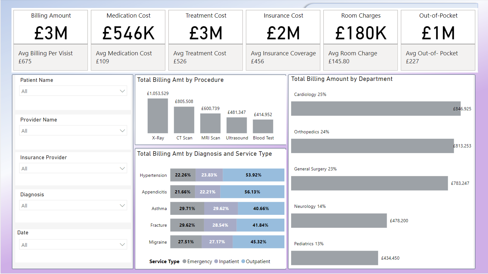

# Healthcare Power BI Dashbord

## Purpose

This dashboard provides insights into healthcare billing, focusing on billing amounts, costs, and patient-related financial metrics. It helps stakeholders understand key metrics such as:
- Total Billing Amount and Average Billing Per Visit
- Breakdown of billing by procedure, diagnosis, and department
- Cost-specific categories (e.g., Medication Cost, Treatment Cost, Room Charges)
- Financial contributions of insurance and out-of-pocket payments
 

## Key Features
- KPIs at the Top: The key performance indicators (KPIs) such as total billing amount, average billing per visit, and specific costs.
- Filters Panel: Dynamic filters (e.g., Patient Name, Provider Name, Insurance Provider, Diagnosis, and Date) allow users to customize their views for detailed insights.
- Breakdowns:
  By Procedure, a bar chart showing total billing amounts by medical procedure. By Department, a horizontal bar chart highlighting contributions of various departments (e.g., Cardiology, Orthopedics)
   And Diagnosis and Service Type, a stacked bar chart breaking down diagnosis-based billing amounts by service type (Emergency, Inpatient, Outpatient).

## Tools and Technologies Used
- Power BI:  **Version: 2.138.1004.0 64-bit (November 2024)**

- Requirements : Analyze and create Healthcare Metrics to meet requirements, consult with our *England Stakeholders* for imput, layout and on time completion
- Gather and Prep the Data : Connect to source data using PBI source data experience, this case Excel
- Clean and Transform Data : Use Power Query Editor (Filter, Merge, Rename, remove dups etc..)
- Create base **STAR SCHEMA MODEL** adopt *FACT* AND *DIMENSION* concepts, implementing the optimal **CROSS FILTERING** direction (**1:M**)
- Implement a **Dynamic DAX CALENDAR**

 
  
## Technical Highlights
- DAX Measures KPIs such as *Avg Billing Per Visit* (**SUMX, DATEADD, DATEDIFF, CALCULATE, ALL** Functions)
- Pre-aggregated metrics: Conditional Columns to aggregate metrics
- Drill-through Feature: Allow users to toggle and view details on the report. Users can **download** this as excel or CVS for share
- Visualization : Bar charts, KPI cards
  

## Drill Through Functionality
Users can toggle from **Overview page** to view **Details page** on the report. Users can **download** this as excel or CVS for share or analysis

## Details Page
-Details page with *Page Navigation* to *Go Back * to Overview page.

 

## Publish and share :

- *Interact with the report here* :
  [Healthcare Provider Dashboard](https://app.powerbi.com/reportEmbed?reportId=0e56522c-bdd0-4810-bde5-0be28b0045e0&autoAuth=true&ctid=78d1fb89-a6cc-4862-a67c-a7287504e26f)
  

## Visitor Count

